# Signet Protocol: Verifiable Proof of Reasoning (VPR)
**Deterministic Telemetry for AI Assets**

Official Repository: [github.com/signetai-io/website](https://github.com/signetai-io/website)

The Signet Protocol (draft-song-signet-04.0) defines a framework for the cryptographic attestation of AI-generated reasoning paths. It transforms non-deterministic LLM outputs into formally verified "Signets" aligned with C2PA 2.3.

## 1. Introduction
As AI moves from "Chat" to "Reasoning," current watermarking standards (C2PA) are insufficient because they only sign the final result, not the process. Signet Protocol introduces **"Process Provenance"** via Verifiable Proof of Reasoning (VPR).

## 2. Core Components
- **2.1. TrustKeyService (TKS)**: A registry of public keys bound to verifiable identities.
- **2.2. Neural Lens Engine**: A deterministic verifier that probes AI telemetry for logic drift.
- **2.3. Universal Tail-Wrap (UTW)**: A Zero-Copy injection method for arbitrary binary formats (Video/Audio/PDF).
- **2.4. Signet-Alpha Live Assistant**: A real-time, voice-first AI notary featuring a dynamic 3D animated avatar with lip-sync, eye movement, and voice-responsive gender switching.

## 3. Architecture


## 4. CLI & Developer Tools (New in v0.4.0)
The protocol now includes standalone Node.js tools and a Web Batch Processor.

### 3.1 Batch Processor (Web)
A high-performance audit engine available at `/#batch`.
- **Supported Formats**: Universal support for **Images** (PNG, JPG, SVG), **Video** (MP4, MOV), **Audio** (WAV, MP3), and **Documents** (PDF).
- **Deep Audit**: Slices binary streams to verify original content integrity against appended signatures.
- **Telemetry**: Real-time reporting of **Throughput (MB/s)** and **Velocity (Files/s)**.
- **Dual Strategy**: Supports both **Embedded (UTW)** and **Sidecar (.json)** verification.

### 3.2 Batch Signer (CLI)
Zero-dependency script for recursively signing directory trees.
```bash
# Download from /#cli
node signet-cli.js --dir ./assets --identity "your.name"
```

## 4. Security Standards
- **Public Keys**: Professional-grade **256-bit** Ed25519.
- **Entropy Floor**: **264-bit Sovereign Grade** (24-word mnemonics).
- **Master Signatory**: `signetai.io:ssl`

## The 4-Layer Execution Pipeline
1. **Vision Substrate (L1)**: Immutable DNA/Thesis.
2. **Neural Lens (L2)**: DAG Mapping of Reasoning steps.
3. **Adversarial Probing (L3)**: Logic Stress Test.
4. **Human-in-the-Loop (L4)**: Final Curatorial Attestation.

## 5. Automated Testing (Hackathon)

For the duration of the hackathon, we have included `puppeteer` as a development dependency to enable rich, automated End-to-End (E2E) self-testing. 

**Why we keep it:**
- **Rapid Iteration:** It allows us to automatically verify that the UI renders correctly and no critical errors are thrown when making fast, complex changes (like updating the 3D Avatar or Live Assistant).
- **Regression Prevention:** The test suite programmatically clicks through the app to catch invisible crashes.
- **Temporary:** Since it's a `devDependency`, it does not affect the production build size. We can safely remove it after the hackathon if we want to reduce the repository size.

**Running the tests:**
Before running the tests, you must ensure your local development server is running in a separate terminal tab:
```bash
npm run dev
```

Then, in a new terminal tab, run the test suite:
```bash
npm run test
```

**Example Output:**
```text
> signet-offline@0.4.0 test
> node tests/run-tests.js

Starting automated self-tests...

Test 1: Loading the main application...
✅ Test 1 Passed: Application loaded successfully.

Test 2: Checking for critical UI elements...
✅ Test 2 Passed: Root element found.

Test 3: Simulating Live Assistant interaction...
✅ Test 3 Passed: Live Assistant button clicked successfully.

Test 4: Verifying no unhandled page errors occurred...
✅ Test 4 Passed: Zero console/page errors detected.

🎉 All automated tests passed successfully!
```

**Troubleshooting:**
- **`net::ERR_CONNECTION_REFUSED at http://localhost:3000`**: This means your development server is not running. Start it first with `npm run dev`.
- **`Error [ERR_MODULE_NOT_FOUND]: Cannot find package 'puppeteer'`**: This means the testing dependencies haven't been downloaded to your local machine yet. Run `npm install` to fix this.

## 6. Local Development & Compilation (MacBook/Linux)

### API Key Configuration

Signet Protocol uses two different Google Gemini APIs that require different security configurations. For the application to work correctly, you must configure **two separate API keys** in your Google Cloud Console:

1. **Diff Engine (Standard API Key)**
   - **Usage:** Used by the Image and Video Diff Engines for semantic analysis.
   - **Protocol:** Standard HTTP requests (`fetch`).
   - **Security:** Requires **HTTP referrers (web sites)** restriction. To ensure both the Google AI Studio Preview and the live website work, add the following to your restricted websites list:
     - `https://ais-dev-volxjj72guvgx7lp3qo724-21086313823.us-west1.run.app/*` (AI Studio Dev Preview)
     - `https://ais-pre-volxjj72guvgx7lp3qo724-21086313823.us-west1.run.app/*` (AI Studio Shared Preview)
     - `https://www.signetai.io/*` (Production Domain)
   - **Environment Variable:** `GEMINI_API_KEY` (or `API_KEY`)

2. **Signet-Alpha Live Assistant (Live API Key)**
   - **Usage:** Used by the real-time voice assistant (Gemini Live API).
   - **Protocol:** WebSockets (`wss://`).
   - **Security:** Requires **None** for Application restrictions. Browsers **do not** send the `Referer` header when opening a WebSocket connection. If you apply HTTP referrer restrictions to this key, the Live Assistant will fail with a `Requests from referer <empty> are blocked` error.
   - **Environment Variable:** Set this unrestricted key in your environment or select it via the UI when prompted by the Live Assistant.

3. **YouTube Data API (YouTube API Key)**
   - **Usage:** Used by the Universal Signer to verify and fetch metadata for YouTube videos before signing them.
   - **Security:** Can be restricted by **HTTP referrers (web sites)** using the same whitelist as the Diff Engine.
   - **Environment Variable:** `YOUTUBE_API_KEY`

To compile the full Signet Platform offline on your machine:

### Prerequisites
- **Node.js** (v18 or higher)
- **npm** (v9 or higher)

### Installation Steps

1. **Clone the Repository**
   ```bash
   git clone https://github.com/signetai-io/website.git
   cd website
   ```

2. **Install Dependencies**
   This installs React, Vite, Tailwind, and the Google GenAI SDK locally.
   ```bash
   npm install
   ```

3. **Run Development Server**
   Starts a hot-reloading local server at `http://localhost:3000`.
   ```bash
   npm run dev
   ```

4. **Compile for Production**
   Generates a static, offline-ready build in the `dist/` folder.
   ```bash
   npm run build
   ```

5. **Preview Production Build**
   To test the compiled artifacts locally:
   ```bash
   npm run preview
   ```

## Live Documentation
The official technical specification is served directly from the platform. Access it by navigating to:
`https://signetai.io/#spec`

---
*Signet Protocol addresses "Agreeability Bias" and "Hallucination Masking" by ensuring architectural independence.*
