# Signet Technical Architecture

This document outlines the technical architecture of the Signet Protocol, a full-stack system designed for creating, signing, and verifying digital assets with a high degree of transparency and integrity.

## Architecture Diagram

The following diagram illustrates the major components of the system and their interactions. It is the canonical representation of the Signet architecture.

```mermaid
graph TD
    subgraph "User's Device (Client-Side)"
        direction TB
        
        subgraph "Signet PWA (React SPA)"
            direction LR
            
            subgraph "Core UI & Views"
                AA["<b>Home & Info Views</b><br>(Mission, Manual, Status)"]
                AB["<b>Legal & Meta</b><br>(Privacy, Terms, Donate)"]
            end

            subgraph "Protocol Specification"
                B1["<b>Spec & Standards</b><br>Displays C2PA alignment<br>and VPR technical draft."]
                B2["<b>Schema Explorer</b><br>Interactive view of the<br>VPR JSON-LD Manifest."]
            end
            
            subgraph "Trust & Identity Tools"
                C1["<b>TrustKey Service (Signer)</b><br>Manages user's Ed25519 key pair,<br>derived from BIP39 mnemonic."]
                C2["<b>Public Verifier</b><br>Client-side tool to inspect<br>Signet-attested media."]
                C3["<b>Local Batch Verifier</b><br>Processes multiple files locally."]
            end
            
            subgraph "Media Labs (Attestation & Analysis)"
                D1["<b>Universal Lab</b><br>Handles various file types."]
                D2["<b>Image Diff Lab</b><br>Compares images using SSIM, pHash."]
                D3["<b>Vector (SVG) Lab</b><br>Injects C2PA manifest into SVG metadata."]
                D4["<b>Document (PDF) Lab</b><br>Attestation for PDF documents."]
                D5["<b>Video Analysis Lab</b><br>Orchestrates frame extraction and analysis."]
            end
        end

        E["<b>Browser Storage (IndexedDB)</b><br><b style='color:red;'>Stores: Private Key & Mnemonic</b><br><i>Data never leaves the user's device.</i>"]
        C1 -- "Stores Keys Locally" --> E
    end

    subgraph "Signet Platform (Backend)"
        direction TB

        F["<b>Firebase Hosting</b><br>Serves the static React PWA<br>and handles caching via SW."]
        
        subgraph "Backend Services (Google Cloud)"
            G["<b>Cloud Functions (Gateway)</b><br>Secure API gateway for routing<br>and authentication."]
            
            subgraph "Trident Engine (Microservices)"
                H1["<b>Provenance Service</b><br>Records & retrieves attestation<br>manifests and hashes."]
                H2["<b>Identity Service</b><br>Manages the Public Key<br>Registry (TrustKey)."]
                H3["<b>AI Proxy Service</b><br>Securely proxies requests to<br>external AI APIs (e.g., Gemini)."]
                H4["<b>Video Frame Extractor</b><br>Uses ffmpeg to extract frames<br>from video files."]
            end
            
            I["<b>Firestore Database</b><br>Stores Public Key Registry,<br>Provenance Manifests, and Hashes."]
        end
        
        J["<b>External AI APIs</b><br>(e.g., Google Gemini)<br>Provides generative and<br>analytical capabilities."]
        K["<b>Google Drive API</b><br>For accessing user-provided<br>video files."]
    end

    %% --- Data Flows ---

    %% Client-Side Flows
    F -- "Serves React App" --> AA
    C1 -- "Publishes Public Key" --> H2
    
    %% Media Labs -> Backend
    D1 & D2 & D3 & D4 -- "Sends Attestation Data" --> G
    D5 -- "Requests Frame Extraction" --> G
    G -- "Routes to Provenance Service" --> H1
    H1 -- "Writes Manifest" --> I
    G -- "Routes to Frame Extractor" --> H4
    H4 -- "Reads Video File" --> K
    K -- "Returns Video Data" --> H4
    H4 -- "Returns Frames" --> D5

    %% Verifier -> Backend
    C2 & C3 -- "Requests Public Key" --> G
    G -- "Routes to Identity Service" --> H2
    H2 -- "Reads Registry" --> I
    H2 -- "Returns Public Key" --> C2 & C3
    
    %% AI Features -> Backend
    AA -- "Sends AI Chat/Analysis Request" --> G
    G -- "Routes to AI Proxy" --> H3
    H3 -- "Calls External API" --> J
    J -- "Returns Response" --> H3
    H3 -- "Forwards Response" --> AA
```

## Component Overview

### Client-Side: User's Device

-   **Signet PWA (React SPA)**: The main user interface. It is a single-page application built with React that runs entirely in the user's browser.
    -   **Trust & Identity Tools**: Includes the `TrustKey Service` for managing cryptographic keys locally and verifier tools for inspecting assets.
    -   **Media Labs**: A suite of tools for attesting different media types, including images, vectors, documents, and videos.
-   **Browser Storage (IndexedDB)**: Used by the `TrustKey Service` to securely store the user's private key and mnemonic phrase. This data never leaves the device.

### Backend: Signet Platform (Google Cloud)

-   **Firebase Hosting**: Serves the static assets for the React PWA to users globally.
-   **Backend Services (Google Cloud)**:
    -   **Cloud Functions (Gateway)**: A secure API gateway that authenticates and routes all incoming requests from the client.
    -   **Trident Engine**: A set of microservices providing the core backend logic.
        -   `Provenance Service`: Records and retrieves C2PA-compliant manifests.
        -   `Identity Service`: Manages the public key registry.
        -   `AI Proxy Service`: Securely manages interactions with external AI models.
        -   `Video Frame Extractor`: A specialized service using `ffmpeg` to pull individual frames from video files for analysis.
    -   **Firestore Database**: The primary database for storing all non-sensitive platform data, including public keys and provenance manifests.

-   **External APIs**:
    -   `Google Gemini`: Provides advanced generative and analytical AI capabilities.
    -   `Google Drive API`: Used by the `Video Frame Extractor` to access video files shared by the user for analysis.
